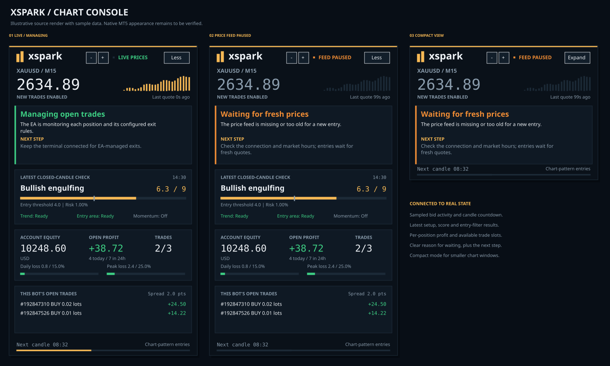
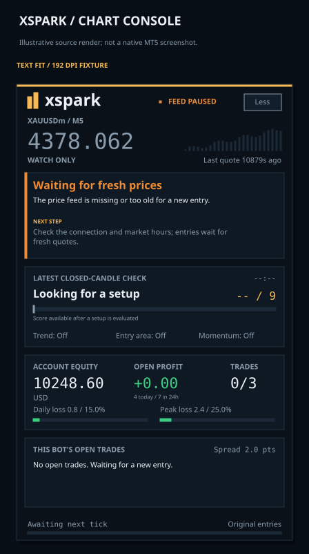

# Live chart dashboard

The chart panel shows what XSpark is doing and why an entry is waiting. Its
controls change the display only. Order sizing, signal checks and position
management still run through the existing trading components.



This is a render of the production drawing commands with test fixtures, not an
MT5 screenshot or trading results. Native fonts and chart painting still need
verification in MetaTrader.

## Reading the panel

- **Live prices:** bid price, age of the latest quote, and 24 recent bid samples.
  The bars show relative price within that sample window, not volume. Samples
  arrive at display refreshes rather than on every market tick. The heartbeat
  pulses only while the connection and quote-age checks pass. Old or missing
  prices show **Feed paused** and dim the price activity.
- **Status and next step:** explains the latest entry decision and what to do.
  Connection, permission and safety faults take priority. A routine between-bar
  position-management tick does not erase an entry refusal. A waiting setup is
  different from a system fault. Hover over the notice for its full explanation
  and original technical reason; long visible text ends with an ellipsis.
- **Latest closed-candle check:** candidate pattern, score, threshold marker,
  selected signal risk, and trend/location/momentum results. Hover over the
  pattern name for all detections and recognition mode. These are the latest
  evaluation, not a promise that an order will be placed. The selected risk is
  before subsequent execution checks and rounding. A blank score is `--`.
- **Account:** equity is account-wide. Open profit and occupied trade slots are
  for this symbol and bot ID. Daily and peak loss bars use the existing safety
  manager's limits; they do not set new limits.
- **Open trades:** separate tickets, lot sizes and floating profit for up to three
  matching positions. The slot count and total profit include **all** matching
  positions, including when there are more than three. Hover for the scope and
  managed-record count. Profit includes swap and excludes commissions. Lot-size
  precision follows the symbol's volume step. The MT5 Trade tab shows the full
  position list. Unreadable position data displays `--`, not a false zero.
- **Candle countdown:** uses the actual current candle and broker-time estimate.
  When that candle expires without another tick, it says **Awaiting next tick**;
  it does not invent the start of a new candle.

A live price feed does not mean an entry is allowed. Read the status card and
entry style together. Preview keeps original entries; watch-only disables new
orders while existing positions continue to receive management.

## Display settings

In **Chart panel and logs**, choose the corner and margins. **Start with a
compact chart panel** hides the lower detail cards. **Animate live dashboard
activity** controls the heartbeat; disabling it leaves real values updating.
**Less / Expand** changes the current view without restarting the EA. The initial
view preference is reapplied when the EA is reinitialized.

**Dashboard size** starts at **125%**, with a supported range of 125–200%.
Use the **+ / −** buttons in the header to change size immediately in 25-point
steps. This changes only the display; it does not restart the EA. The Inputs
value is the startup preference and is reapplied after reinitialization.

The whole panel now grows with display DPI and measured font height. Visible
panel text never uses a font below 9 points. The earlier overflow fix kept the
panel at a fixed pixel size and reduced fonts on high-DPI displays; that made
otherwise non-overlapping text unreadably small. This version retains measured
wrapping and column bounds while enlarging the space available for the text.

The design uses 400 × 660 logical pixels (compact: 400 × 286), multiplied by
native display scale and the chosen size. At typical 192 DPI and 125%, the full
panel is about 1000 × 1650 chart pixels; compact is 1000 × 715, before margins.
Font substitution can require more space. Narrow windows constrain width and
truncate text instead of reducing its point size; narrow/short windows use
compact view. To show the full detail cards, enlarge the chart or hide the
Strategy Tester/Toolbox panes. Extremely small windows can still clip the panel;
they cannot contain readable text and all details at once.

Ticks may refresh the panel at most twice per second, with a one-second timer for
quiet periods. Resize/collapse events refresh immediately. Native chart objects
are reused. Nonvisual tester runs skip the panel and annotations. No external
runtime, image asset or network service is used by the EA.

## Text sizing and the Mac/Wine overflow correction

Text is fitted to explicit pixel boxes. Font point sizes account for the reported
screen DPI, then native font measurements check line height and available width.
This also handles wider fallback fonts without letting a title collide with a
score or the live-feed label run into the button. Notice text wraps at measured
word boundaries; overflow ends in an ellipsis and full text remains in tooltips.
Empty fields are hidden and contain a space, avoiding MT5's default `Label` text.
Reinitialization rebuilds the panel's paint order while preserving entry and
pattern annotations and other indicators' objects.

The implementation uses [TextSetFont](https://www.mql5.com/en/docs/objects/textsetfont)
with the documented negative point conversion for label matching and
[TextGetSize](https://www.mql5.com/en/docs/objects/textgetsize) for pixel bounds.
Arial is the fallback if the configured font cannot be selected. If no usable
metrics are available, affected text stays hidden until measurement recovers.



The fixture above uses 192 DPI (200% scaling), XAUUSDm/M5, a stale quote and no
open positions. It is an illustrative source render, not a native terminal capture.
The regression suite models 96, 120, 144, 192 and 288 DPI, narrow/full layouts,
incorrectly reported DPI, wider substituted glyphs, long values, empty rows,
measurement failure/recovery, minimum visible font size, and +/− size bounds. The previous implementation fails the new layout
regressions. These font doubles still cannot prove native Mac/Wine rendering.

After updating **all** include files (including `UI/DashboardText.mqh`), compile
`XSpark.mq5` and reattach/reinitialize the EA. Check the same chart and display
scale from the reported screenshot: no overlapping labels, no default `Label`
placeholders, readable text, visible account values in expanded view, and working
Less/Expand and +/− controls. Native compilation
and this terminal-side check remain required.

## Error messages

Warnings, errors and critical journal entries now include a readable title,
explanation and next step, followed by the exact original **Technical details**.
This preserves broker return codes, identifiers and machine reasons. Info/debug
records retain their original format. Stored reasons and decision comparisons
are unchanged; translation happens only at display/log output.

Known messages explain configuration conflicts, unsupported account types,
missing history, risk/slot limits, minimum volume, margin, stale prices, broker
responses, stop protection and trade-state recovery. Unrecognized errors remain
visible as **Something needs attention** with their original reason and the
component to inspect; they are never presented as successful operations.

## Validation

`python3 tools/test_dashboard.py` runs 145 assertions against adapted production
presentation code and chart-object doubles, including logger output, countdown,
clamping, compact toggling, stale feed, multiple-position display and cleanup.
This is C++ portability testing, **not native MQL5 compilation or MT5 execution**.
The existing 151 portable strategy/risk/position assertions also pass.

Generate the illustrative preview with:

```sh
python3 tools/test_dashboard.py --scene /tmp/xspark-scenes.txt
python3 tools/render_dashboard_preview.py /tmp/xspark-scenes.txt docs/dashboard-preview.svg /tmp/dashboard-preview.png
python3 tools/render_dashboard_preview.py /tmp/xspark-scenes.txt docs/dashboard-text-fit.svg /tmp/dashboard-text-fit.png --scene screenshot_fixed_192 --dpi 192
```

The PNG review renderer requires Pillow and DejaVu fonts. These are tooling-only
requirements, not EA dependencies. Preview values are fixtures.

Before release, compile the EA and both dashboard test scripts in MetaEditor with
zero errors and warnings; run the scripts. Then use a visual Strategy Tester run
and a demo chart to check native paint order, font/DPI fit, all four corners,
resize/collapse, two or more separate open positions, a stale/disconnected feed,
watch-only/permission states, safety stops and attach/remove/reinitialize cleanup.
Compare trading decisions with the same data/settings: the UI must not change
orders. Native compilation, terminal execution and profitability validation were
not performed in the development environment.
